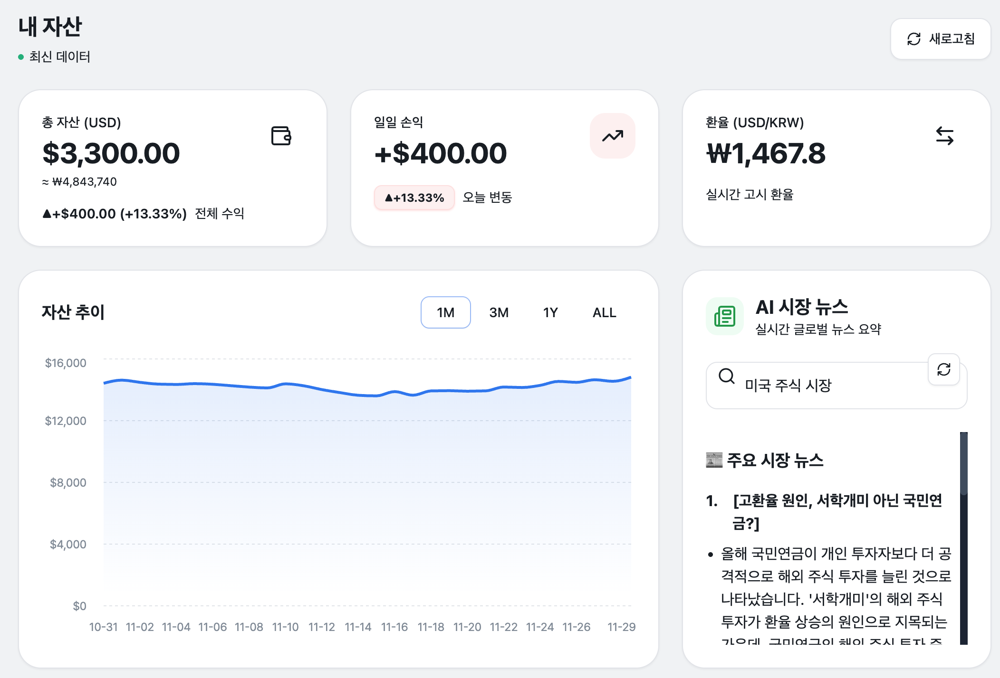
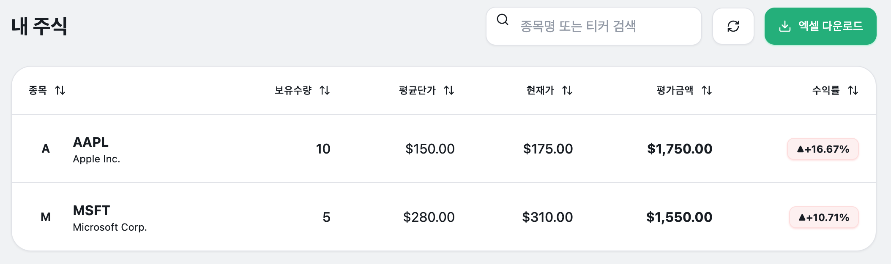
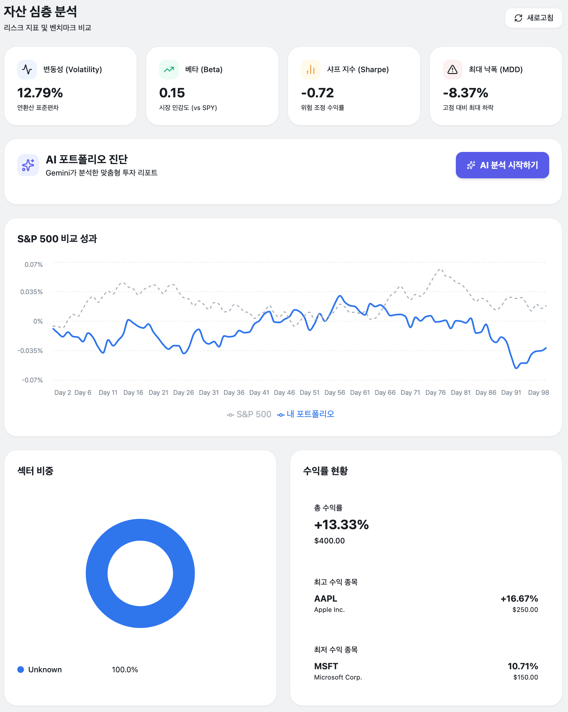
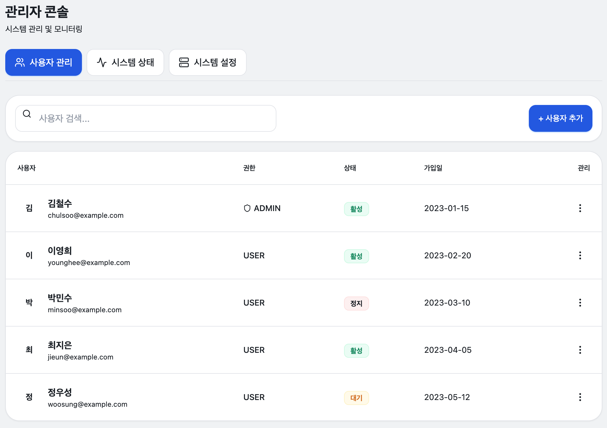

# Kabu Agent 기술 문서

한국투자증권(KIS) Open API를 활용한 해외주식 포트폴리오 관리 시스템의 기술 문서입니다.

## 문서 목록

| 문서 | 설명 | 대상 독자 |
|-----|------|----------|
| [프론트엔드 아키텍처](./FRONTEND_ARCHITECTURE.md) | FSD 패턴, 계층 구조, 데이터 흐름 | Frontend 개발자 |
| [시스템 요구사항](./system-requirements.md) | 기능/비기능 요구사항, 제약사항 | 전체 개발자, PM |

## 시스템 개요

### 아키텍처

```
┌─────────────┐     ┌─────────────┐     ┌─────────────┐
│   Frontend  │────▶│   Backend   │────▶│  KIS API    │
│  (React 19) │     │  (FastAPI)  │     │  (증권 데이터) │
└─────────────┘     └──────┬──────┘     └─────────────┘
                           │
              ┌────────────┼────────────┐
              ▼            ▼            ▼
        ┌──────────┐ ┌──────────┐ ┌──────────┐
        │ PostgreSQL│ │  Redis   │ │ Gemini AI │
        │   (DB)    │ │ (캐시)   │ │ (분석)    │
        └──────────┘ └──────────┘ └──────────┘
```

### Frontend 구조 (FSD)

```
src/
├── app/        # 앱 초기화, 라우팅, 프로바이더
├── pages/      # 라우트 단위 페이지 컴포넌트
├── widgets/    # 복합 UI 블록 (레이아웃, 사이드바)
├── features/   # 기능 단위 모듈 (auth, portfolio, analysis)
├── entities/   # 도메인 엔티티 (stock, user, news)
└── shared/     # 공유 모듈 (api, ui, lib, types)
```

### Backend 구조

```
src/
├── api/        # API 라우트 (FastAPI)
├── services/   # 비즈니스 로직
├── database/   # DB 연결 및 모델
├── cache/      # Redis 캐시
├── ai/         # Gemini AI 연동
└── kis_api.py  # KIS Open API 클라이언트
```

## 스크린샷

| 화면 | 설명 |
|-----|------|
|  | 홈 - 자산 현황 및 AI 뉴스 |
|  | 내 주식 - 보유 종목 상세 |
|  | 자산 분석 - 섹터 비중, AI 진단 |
|  | 관리자 - 시스템 모니터링 |

## 빠른 링크

- [메인 README](../README.md)
- [환경 변수 예시](../.env.example)

