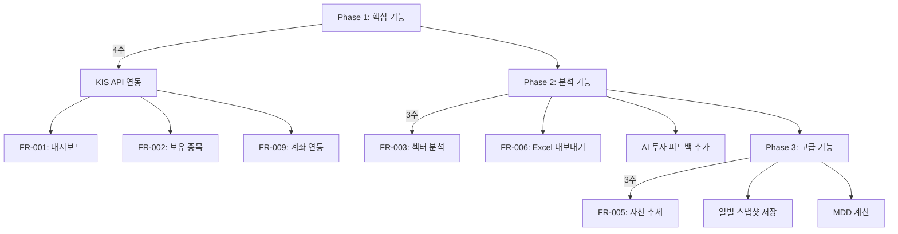

# KIS Open API 기능 구현 가능성 분석

> **작성일**: 2025-11-24  
> **목적**: 시스템 요구사항과 KIS API 기능 매핑, 구현 가능/불가능 기능 정리, 추가 제안 기능 분석

---

## 📋 목차

1. [요구사항별 구현 가능성 분석](#요구사항별-구현-가능성-분석)
2. [KIS API 구현 가능 기능](#kis-api-구현-가능-기능)
3. [KIS API 구현 불가능 기능](#kis-api-구현-불가능-기능)
4. [요건 정의서에 없는 추가 제안 기능](#요건-정의서에-없는-추가-제안-기능)
5. [구현 우선순위 및 권장사항](#구현-우선순위-및-권장사항)

---

## 요구사항별 구현 가능성 분석

### ✅ **완전 구현 가능** (KIS API 직접 지원)

#### FR-001: 포트폴리오 대시보드

| 기능 | KIS API | 구현 방법 |
|------|---------|-----------|
| 총자산 표시 (USD/KRW) | `inquire_balance` | `output1`에서 총 평가금액 조회 |
| **일일 수익률(%)** | `inquire_balance` | 현재가 대비 전일 대비 계산 (실시간) |
| 전일 대비 손익 금액 | `inquire_balance` | 평가손익 필드 직접 제공 |
| 보유 종목 수 | `inquire_balance` | `output1` 배열 길이 |
| 자산 구성 차트 | `inquire_balance` | 주식 평가금액 vs 외화예수금 비율 |

> [!NOTE]
> - 일일 수익률은 **당일 실시간** 계산 가능 (현재가 기준)
> - 전일 종가 대비 수익률 계산 로직 필요

#### FR-002: 보유 종목 상세 조회

| 기능 | KIS API | 구현 방법 |
|------|---------|-----------|
| 종목별 보유수량, 평균매수가, 현재가 | `inquire_balance` | `output1` 배열 직접 제공 |
| 종목별 평가금액, 평가손익, 수익률 | `inquire_balance` | 계산 필드 포함 |
| 종목별 비중 | `inquire_balance` | 평가금액 대비 비중 계산 |
| 정렬/필터링 | Frontend | 프론트엔드 로직 |

> [!TIP]
> - KIS API는 종목별 상세 정보를 완벽하게 제공
> - 정렬/필터링은 받은 데이터를 클라이언트에서 처리

#### FR-003: 섹터별 분석

| 기능 | KIS API | 구현 방법 |
|------|---------|-----------|
| 섹터 정보 조회 | `search_info` (상품기본정보) | 종목별 섹터 정보 조회 |
| 섹터별 투자 비중 | `inquire_balance` + 섹터 매핑 | 종목별 평가금액과 섹터 매칭 |
| 섹터별 평가금액 및 수익률 | 계산 로직 | 섹터별 집계 계산 |

> [!IMPORTANT]
> - `search_info` API로 종목별 섹터 정보 확보 필요
> - 섹터 정보 캐싱 권장 (API 호출 최소화)

#### FR-006: 엑셀 파일 내보내기

| 기능 | 구현 방법 |
|------|-----------|
| 포트폴리오 종합 현황 시트 | 백엔드에서 Excel 생성 (OpenPyXL) |
| 보유 종목 상세 정보 시트 | KIS API 데이터 변환 |
| 섹터별 분석 시트 | 집계 데이터 생성 |

> [!NOTE]
> - 기존 백엔드 코드에 Excel 생성 로직 이미 구현됨 (`src/excel/`)
> - KIS API 데이터를 기존 Excel 템플릿에 매핑만 하면 됨

#### FR-008: 사용자 인증

| 기능 | 구현 방법 |
|------|-----------|
| 로그인/로그아웃 | JWT 토큰 기반 인증 (백엔드 구현) |
| KIS API 토큰 관리 | `authenticate()` 메서드 이미 구현 |

> [!TIP]
> - 프론트엔드 로그인 UI 이미 구현됨 (`App.tsx`)
> - 백엔드 JWT 인증 추가 필요

#### FR-009: 계좌 연동 관리

| 기능 | KIS API | 구현 방법 |
|------|---------|-----------|
| KIS API 키 등록 | Config | `.env` 파일 설정 |
| 계좌번호 등록 | Config | 환경변수 관리 |
| 연동 상태 확인 | `authenticate()` | 토큰 유효성 검증 |

---

### ⚠️ **부분 구현 가능** (추가 로직 필요)

#### FR-004: 수익률 분석

| 기능 | KIS API | 구현 가능 여부 | 비고 |
|------|---------|----------------|------|
| 일일 수익률 | `inquire_balance` | ✅ 가능 | 실시간 계산 |
| **월간 수익률** | `inquire_period_profit` | ⚠️ **부분 가능** | 기간손익 조회로 계산 필요 |
| **연간 수익률** | `inquire_period_profit` | ⚠️ **부분 가능** | 기간손익 조회로 계산 필요 |
| 기간별 최고/최저 수익률 | 별도 로직 | ⚠️ 계산 필요 | 일별 데이터 수집 및 계산 |

> [!WARNING]
> **`inquire_period_profit` API 분석 결과**:
> - `INQR_STRT_DT`, `INQR_END_DT`로 특정 기간의 손익 조회 가능
> - **그러나**: 일별 세분화된 수익률은 직접 제공되지 않음
> - **해결 방법**: 
>   1. 시작일과 종료일 손익 차이로 기간 수익률 계산
>   2. 일별 계산이 필요한 경우 자체 DB에 일별 스냅샷 저장 필요

#### FR-005: 자산 추세 분석

| 기능 | KIS API | 구현 가능 여부 | 비고 |
|------|---------|----------------|------|
| 일별 총자산 변화 | `inquire_period_trans` + `inquire_balance` | ⚠️ **재계산 필요** | 과거 자산 스냅샷 없음 |
| 투자 입출금 내역 | `inquire_period_trans` | ✅ 가능 | 일별 거래내역 제공 |

> [!CAUTION]
> **제한사항**:
> - KIS API는 **과거 특정 시점의 총자산 스냅샷을 제공하지 않음**
> - 거래내역(`inquire_period_trans`)과 현재 잔고(`inquire_balance`)를 조합하여 역계산 필요
> - **권장**: PostgreSQL에 일별 자산 스냅샷 저장 (배치 작업)

#### FR-011: 시스템 모니터링

| 기능 | 구현 방법 |
|------|-----------|
| API 호출 통계 | 로깅 및 집계 (Redis 활용) |
| 시스템 성능 지표 | 서버 모니터링 도구 |
| 오류 로그 조회 | 로깅 시스템 |

---

### ❌ **구현 불가능** (KIS API 미지원)

#### FR-004 (일부): 고급 수익률 지표

| 기능 | 불가능 이유 | 대안 |
|------|------------|------|
| **최대 낙폭(MDD)** | 과거 일별 포트폴리오 가치 데이터 없음 | 자체 DB에 일별 자산 저장 후 계산 |
| **누적 수익률** | 계좌 개설 시점 원금 데이터 없음 | 사용자 입력 + 자체 계산 |

> [!IMPORTANT]
> **KIS API 한계**:
> - `inquire_period_profit`은 특정 기간의 **손익 합계**만 제공
> - 일별 포트폴리오 가치 변동 추적 불가
> - MDD 계산을 위한 시계열 데이터 부재

**해결 방안**:
```python
# 일별 자산 스냅샷 저장 (PostgreSQL)
daily_snapshot = {
    "date": "2025-11-24",
    "total_assets": 150000000,
    "portfolio_value": 120000000,
    "cash": 30000000
}

# MDD 계산 로직
def calculate_mdd(snapshots):
    peak = snapshots[0]['total_assets']
    max_drawdown = 0
    for snapshot in snapshots:
        if snapshot['total_assets'] > peak:
            peak = snapshot['total_assets']
        drawdown = (peak - snapshot['total_assets']) / peak
        max_drawdown = max(max_drawdown, drawdown)
    return max_drawdown * 100
```

#### FR-007: PDF 리포트 생성

| 기능 | 불가능 이유 | 우선순위 |
|------|------------|---------|
| PDF 리포트 | KIS API와 무관 (백엔드 구현 사항) | Low |

> [!NOTE]
> - Excel 내보내기(FR-006)가 우선
> - PDF는 Phase 4 (추가 기능)

---

## KIS API 구현 가능 기능

### 1️⃣ **잔고 및 보유 종목 조회** ✅

**API**: `inquire_balance` (해외주식 잔고)

```python
# 제공 데이터
{
    "output1": [
        {
            "pdno": "AAPL",           # 종목코드
            "prdt_name": "Apple Inc", # 종목명
            "frcr_pchs_amt1": "150.00", # 매수금액(외화)
            "ovrs_cblc_qty": "10",    # 잔고수량
            "pchs_avg_pric": "170.00", # 매수평균가격
            "ovrs_stck_evlu_amt": "1750.00", # 평가금액(외화)
            "frcr_evlu_pfls_amt": "50.00",   # 평가손익(외화)
            "evlu_pfls_rt": "3.45"    # 평가손익율
        }
    ],
    "output2": {
        "frcr_buy_amt_smtl1": "10000.00",  # 매수금액합계(외화)
        "ovrs_rlzd_pfls_amt": "500.00",    # 실현손익금액(외화)
        "frcr_evlu_amt_smtl": "11500.00"   # 평가금액합계(외화)
    }
}
```

**구현 가능 기능**:
- ✅ 총자산 조회
- ✅ 종목별 상세 정보
- ✅ 수익률 계산
- ✅ 자산 구성 비율

---

### 2️⃣ **기간 손익 조회** ⚠️ (부분 가능)

**API**: `inquire_period_profit` (기간손익)

```python
# 제공 데이터 (추정)
{
    "output": {
        "strt_dt": "20251001",        # 조회시작일
        "end_dt": "20251031",         # 조회종료일
        "rlzd_pfls": "1000.00",       # 실현손익
        "evlu_pfls": "500.00",        # 평가손익
        "tot_pfls": "1500.00"         # 총손익
    }
}
```

> [!WARNING]
> **제약 사항**:
> - 일별 세분화된 손익 데이터는 제공되지 않음
> - 시작일~종료일의 **합계 손익**만 제공
> - 일별 수익률 계산을 위해서는 **매일 API 호출 + DB 저장** 필요

**구현 가능 기능**:
- ⚠️ 월간/연간 수익률 (기간 합계)
- ❌ 일별 수익률 추이 (자체 저장 필요)

---

### 3️⃣ **거래내역 조회** ✅

**API**: `inquire_period_trans` (일별거래내역)

```python
# 제공 데이터 (이미 구현됨 - kis_api.py)
{
    "output": [
        {
            "ord_dt": "20251120",      # 주문일자
            "pdno": "TSLA",            # 종목코드
            "ft_ord_qty": "5",         # 주문수량
            "ft_ccld_qty": "5",        # 체결수량
            "ft_ccld_unpr3": "250.00", # 체결단가
            "ft_ccld_amt3": "1250.00"  # 체결금액
        }
    ]
}
```

**구현 가능 기능**:
- ✅ 매매 거래내역 조회
- ✅ 거래금액, 수량 추적
- ⚠️ 과거 총자산 재계산 (복잡)

---

### 4️⃣ **종목 정보 조회** ✅

**API**: `search_info` (상품기본정보)

```python
# 제공 데이터 (추정)
{
    "output": {
        "symb": "AAPL",
        "name": "Apple Inc",
        "sector": "Technology",      # 섹터
        "industry": "Consumer Electronics" # 산업
    }
}
```

**구현 가능 기능**:
- ✅ 섹터별 분석
- ✅ 종목명 조회

---

### 5️⃣ **시세 및 뉴스 조회** ✅

**API**: 
- `get_overseas_stock_price` (현재가)
- `get_overseas_news` (뉴스)
- `get_overseas_index_price` (지수)

**구현 가능 기능**:
- ✅ 실시간 주가 조회
- ✅ 시장 뉴스
- ✅ 주요 지수 (NASDAQ, S&P500)

---

## KIS API 구현 불가능 기능

### ❌ 1. 최대 낙폭(MDD) 계산

**불가능 이유**:
- 과거 일별 포트폴리오 총자산 스냅샷이 없음
- `inquire_period_trans`는 거래내역만 제공, 자산 변화는 역계산 필요

**대안**:
```sql
-- PostgreSQL 스키마 예시
CREATE TABLE daily_portfolio_snapshot (
    id SERIAL PRIMARY KEY,
    user_id INT,
    date DATE,
    total_assets DECIMAL(15, 2),
    stock_value DECIMAL(15, 2),
    cash DECIMAL(15, 2),
    created_at TIMESTAMP DEFAULT NOW()
);

-- 배치 작업으로 매일 저장
INSERT INTO daily_portfolio_snapshot (user_id, date, total_assets, ...)
SELECT ...;
```

---

### ❌ 2. 누적 수익률 (계좌 개설 이후)

**불가능 이유**:
- 계좌 최초 입금액 (원금) 정보 없음
- KIS API는 현재 상태만 제공

**대안**:
1. 사용자가 초기 투자 원금 직접 입력
2. 첫 조회 시점을 기준으로 설정
3. 이후부터 누적 수익률 계산

```python
cumulative_return = ((current_total - initial_investment) / initial_investment) * 100
```

---

### ❌ 3. 일별 포트폴리오 가치 변화 추이

**불가능 이유**:
- KIS API는 **현재 시점 스냅샷**만 제공
- 과거 특정 날짜의 포트폴리오 가치를 조회할 수 없음

**대안**:
- 매일 배치 작업으로 `inquire_balance` 호출 후 DB 저장
- Redis 캐싱 + PostgreSQL 영구 저장

---

## 요건 정의서에 없는 추가 제안 기능

### 🎯 카테고리 1: **실시간 알림 기능**

> KIS API는 웹소켓 실시간 시세를 제공하지 않지만, **폴링(Polling) 방식**으로 구현 가능

#### 1.1 가격 알림 (Price Alert)

**기능**:
- 특정 종목이 목표가에 도달하면 알림
- 예: "AAPL이 $200에 도달했습니다!"

**구현 방법**:
```python
# 백엔드에서 주기적으로 체크 (Redis + Celery)
@celery.task
def check_price_alerts():
    alerts = db.query(PriceAlert).filter(active=True).all()
    for alert in alerts:
        current_price = kis_client.get_overseas_stock_price(alert.symbol)
        if current_price >= alert.target_price:
            send_notification(alert.user_id, f"{alert.symbol} reached ${alert.target_price}")
```

**우선순위**: Medium  
**KIS API 호출**: `get_overseas_stock_price` (주기적)

---

#### 1.2 수익률 알림

**기능**:
- 일일 수익률이 +5% 또는 -5% 이상일 때 알림
- 포트폴리오 총자산이 특정 금액 도달 시 알림

**우선순위**: Medium

---

### 🎯 카테고리 2: **AI 기반 분석 기능**

> 기존 백엔드에 `src/ai/` 모듈이 있음 → 활용 가능!

#### 2.1 AI 투자 피드백

**기능**:
- 포트폴리오 분석 + AI 코멘트
- 섹터 분산 조언
- 리밸런싱 제안

**구현 방법**:
- 기존 `src/ai/feedback.py` 활용
- GPT-4 API로 포트폴리오 데이터 분석

```python
# 예시
def generate_portfolio_advice(portfolio_data):
    prompt = f"""
    다음 포트폴리오를 분석하고 투자 조언을 제공하세요:
    - 총자산: ${portfolio_data['total_assets']}
    - 섹터 분포: {portfolio_data['sector_distribution']}
    - 일일 수익률: {portfolio_data['daily_return']}%
    """
    return openai.ChatCompletion.create(model="gpt-4", messages=[...])
```

**우선순위**: High (차별화 요소!)

---

#### 2.2 AI 뉴스 요약

**기능**:
- KIS API로 받은 뉴스를 AI가 요약
- 포트폴리오 관련 뉴스 필터링

**구현 방법**:
- 기존 `src/ai/news_summary.py` 활용
- `get_overseas_news` + GPT 요약

**우선순위**: Medium

---

### 🎯 카테고리 3: **비교 및 벤치마킹 기능**

#### 3.1 시장 지수 대비 성과 비교

**기능**:
- 내 포트폴리오 vs S&P500 수익률 비교
- 나스닥 대비 성과 시각화

**KIS API**:
- `get_overseas_index_price` (NAS, SPX, DOW)

**구현**:
```python
# 프론트엔드 차트
{
    "labels": ["1개월", "3개월", "1년"],
    "datasets": [
        {
            "label": "내 포트폴리오",
            "data": [2.5, 8.3, 25.7]
        },
        {
            "label": "S&P 500",
            "data": [1.8, 5.2, 18.3]
        }
    ]
}
```

**우선순위**: High (사용자 만족도 ↑)

---

#### 3.2 포트폴리오 히트맵 (Heatmap)

**기능**:
- 종목별 수익률을 색상으로 시각화
- 한눈에 손익 파악

**예시**:
- 🟩 +10% 이상: 진한 초록
- 🟨 0~5%: 노랑
- 🟥 -5% 이하: 빨강

**우선순위**: Medium

---

### 🎯 카테고리 4: **거래 분석 기능**

#### 4.1 매매 패턴 분석

**기능**:
- 월별/분기별 매매 횟수
- 평균 보유 기간
- 수익 거래 vs 손실 거래 비율

**KIS API**:
- `get_overseas_trading_history` 활용

**우선순위**: Low (Phase 4)

---

#### 4.2 배당 수익 추적

**기능**:
- 배당 받은 금액 추적
- 배당 수익률 계산

> [!WARNING]
> KIS API에 배당 관련 엔드포인트가 있는지 확인 필요

**우선순위**: Low

---

### 🎯 카테고리 5: **사용자 경험(UX) 개선**

#### 5.1 다크 모드 / 라이트 모드

**우선순위**: Low (이미 다크 모드로 구현됨)

---

#### 5.2 모바일 앱 (React Native)

**우선순위**: Low (Phase 4+)

---

#### 5.3 다국어 지원 (영어/한국어)

**우선순위**: Low

---

### 🎯 카테고리 6: **데이터 시각화 고도화**

#### 6.1 인터랙티브 차트

**기능**:
- Recharts / Chart.js로 드래그 가능한 차트
- 기간 필터 (1D, 1W, 1M, 3M, 1Y, ALL)

**우선순위**: Medium (사용자 경험 ↑)

---

#### 6.2 포트폴리오 타임라인

**기능**:
- 매수/매도 이벤트를 타임라인으로 시각화
- 주요 이벤트 표시 (예: "TSLA 10주 매수")

**우선순위**: Medium

---

## 구현 우선순위 및 권장사항

### Phase 1: 핵심 기능 (4주) - **KIS API 완전 구현 가능**

| 우선순위 | 기능 | 구현 난이도 | KIS API 지원 |
|---------|------|-----------|--------------|
| 🔴 High | FR-001: 포트폴리오 대시보드 | ⭐ Low | ✅ 완전 지원 |
| 🔴 High | FR-002: 보유 종목 상세 조회 | ⭐ Low | ✅ 완전 지원 |
| 🔴 High | FR-008: 사용자 인증 | ⭐⭐ Medium | ✅ (백엔드) |
| 🔴 High | FR-009: 계좌 연동 관리 | ⭐ Low | ✅ 완전 지원 |

**권장 사항**:
- ✅ KIS API `inquire_balance` 연동 최우선
- ✅ 프론트엔드 UI 이미 구현됨 → 백엔드 API 연결만 하면 됨
- ⚠️ JWT 인증 백엔드 구현 필요

---

### Phase 2: 분석 기능 (3주) - **부분 구현 + 자체 로직**

| 우선순위 | 기능 | 구현 난이도 | KIS API 지원 |
|---------|------|-----------|--------------|
| 🟡 Medium | FR-003: 섹터별 분석 | ⭐⭐ Medium | ✅ `search_info` 활용 |
| 🟡 Medium | FR-004: 수익률 분석 (일일/월간) | ⭐⭐⭐ High | ⚠️ 부분 지원 |
| 🔴 High | FR-006: 엑셀 내보내기 | ⭐⭐ Medium | ✅ (백엔드 이미 구현) |
| 🔴 High | **[추가] AI 투자 피드백** | ⭐⭐⭐ High | ✅ (AI API) |

**권장 사항**:
- ⚠️ `inquire_period_profit` API 테스트 필요 (월간/연간 수익률 계산)
- ✅ 기존 Excel 생성 로직(`src/excel/`) 재사용
- 🎯 **AI 피드백 기능 추가 강력 권장** (차별화 요소!)

---

### Phase 3: 관리 기능 (3주) - **자체 구현 + DB 저장**

| 우선순위 | 기능 | 구현 난이도 | KIS API 지원 |
|---------|------|-----------|--------------|
| 🟡 Medium | FR-010: 사용자 관리 (Admin) | ⭐⭐⭐ High | ❌ (백엔드) |
| 🟡 Medium | FR-011: 시스템 모니터링 | ⭐⭐⭐ High | ❌ (백엔드) |
| 🟡 Medium | FR-005: 자산 추세 분석 | ⭐⭐⭐⭐ Very High | ❌ **자체 DB 필요** |
| 🟡 Medium | **[추가] 가격 알림** | ⭐⭐⭐ High | ⚠️ 폴링 방식 |

**권장 사항**:
- ⚠️ **PostgreSQL + Redis 설정 필수**
- 🔴 **일별 자산 스냅샷 배치 작업 구현** (FR-005, MDD 계산 위해)
- ⚠️ Celery 등 스케줄러 도입 검토

---

### Phase 4: 추가 기능 (2주+) - **고급 기능**

| 우선순위 | 기능 | 구현 난이도 | KIS API 지원 |
|---------|------|-----------|--------------|
| 🟢 Low | FR-007: PDF 리포트 | ⭐⭐⭐ High | ❌ (백엔드) |
| 🟢 Low | FR-012: 데이터 관리 | ⭐⭐⭐ High | ❌ (백엔드) |
| 🟡 Medium | **[추가] 시장 지수 대비 비교** | ⭐⭐ Medium | ✅ `get_overseas_index_price` |
| 🟢 Low | **[추가] 매매 패턴 분석** | ⭐⭐⭐ High | ⚠️ `inquire_period_trans` |

---

## 요약 및 결론

### ✅ **KIS API로 완전히 구현 가능한 기능**

1. **포트폴리오 대시보드** (FR-001)
2. **보유 종목 상세 조회** (FR-002)
3. **섹터별 분석** (FR-003)
4. **엑셀 내보내기** (FR-006)
5. **계좌 연동** (FR-009)

---

### ⚠️ **부분 구현 가능한 기능** (추가 로직 필요)

1. **수익률 분석** (FR-004) - 월간/연간은 `inquire_period_profit`으로 가능, 일별은 자체 계산
2. **자산 추세 분석** (FR-005) - **DB 저장 필수**

---

### ❌ **KIS API로 불가능한 기능** (자체 구현 필요)

1. **최대 낙폭(MDD)** - 일별 스냅샷 저장 후 계산
2. **누적 수익율** - 사용자 초기 투자금 입력 필요
3. **과거 특정 시점 총자산** - 매일 배치로 저장

---

### 🎯 **추가 제안 기능 (요건 정의서에 없음)**

| 카테고리 | 기능 | 우선순위 | 차별화 효과 |
|---------|------|---------|------------|
| AI | **AI 투자 피드백** | 🔴 High | ⭐⭐⭐⭐⭐ |
| AI | AI 뉴스 요약 | 🟡 Medium | ⭐⭐⭐ |
| 실시간 알림 | 가격 알림 | 🟡 Medium | ⭐⭐⭐⭐ |
| 비교 분석 | **시장 지수 대비 비교** | 🔴 High | ⭐⭐⭐⭐ |
| 시각화 | 포트폴리오 히트맵 | 🟡 Medium | ⭐⭐⭐ |
| 기록 분석 | 매매 패턴 분석 | 🟢 Low | ⭐⭐ |

> [!TIP]
> **최우선 추가 기능**:
> 1. 🤖 **AI 투자 피드백** (기존 `src/ai/` 활용)
> 2. 📊 **시장 지수 대비 비교** (S&P 500 vs 내 포트폴리오)
> 3. 🔔 **가격 알림** (목표가 도달 시 알림)

---

### 📌 핵심 권장사항

#### 1. **즉시 구현 가능한 기능 우선**



#### 2. **DB 스키마 설계 필수**

```sql
-- 일별 포트폴리오 스냅샷
CREATE TABLE daily_portfolio_snapshot (
    id SERIAL PRIMARY KEY,
    user_id INT NOT NULL,
    date DATE NOT NULL,
    total_assets DECIMAL(15, 2),
    stock_value DECIMAL(15, 2),
    cash DECIMAL(15, 2),
    daily_return DECIMAL(5, 2),
    created_at TIMESTAMP DEFAULT NOW(),
    UNIQUE(user_id, date)
);

-- 가격 알림
CREATE TABLE price_alerts (
    id SERIAL PRIMARY KEY,
    user_id INT NOT NULL,
    symbol VARCHAR(10),
    target_price DECIMAL(10, 2),
    condition VARCHAR(10), -- 'above' or 'below'
    active BOOLEAN DEFAULT TRUE,
    created_at TIMESTAMP DEFAULT NOW()
);
```

#### 3. **백엔드 API 엔드포인트 설계**

```python
# FastAPI 예시
@app.get("/api/portfolio/dashboard")
async def get_dashboard(user_id: int):
    """FR-001: 대시보드 데이터"""
    balance = kis_client.get_overseas_balance()
    return {
        "total_assets": calculate_total_assets(balance),
        "daily_return": calculate_daily_return(balance),
        "holdings_count": len(balance['output1']),
        "asset_composition": calculate_composition(balance)
    }

@app.get("/api/portfolio/holdings")
async def get_holdings(user_id: int):
    """FR-002: 보유 종목"""
    balance = kis_client.get_overseas_balance()
    return format_holdings(balance['output1'])

@app.get("/api/analysis/sector")
async def get_sector_analysis(user_id: int):
    """FR-003: 섹터 분석"""
    balance = kis_client.get_overseas_balance()
    sectors = {}
    for holding in balance['output1']:
        sector_info = kis_client.search_info(holding['pdno'])
        # 섹터별 집계...
    return sectors

@app.get("/api/export/excel")
async def export_excel(user_id: int):
    """FR-006: Excel 내보내기"""
    # 기존 src/excel/ 로직 활용
    pass
```

---

## 다음 단계 (Next Steps)

1. ✅ **이 분석 문서 리뷰 및 승인**
2. 🔧 **Phase 1 구현 시작**:
   - KIS API `inquire_balance` 백엔드 연동
   - 프론트엔드 Dashboard 데이터 연결
   - JWT 인증 구현
3. 🧪 **`inquire_period_profit` API 테스트**:
   - 월간/연간 수익률 계산 가능 여부 확인
   - 일별 데이터 제공 여부 확인
4. 🗄️ **PostgreSQL + Redis 환경 구축**
5. 🤖 **AI 피드백 기능 우선 개발** (차별화 요소!)

---

**문서 작성자**: AI Assistant  
**마지막 업데이트**: 2025-11-24
